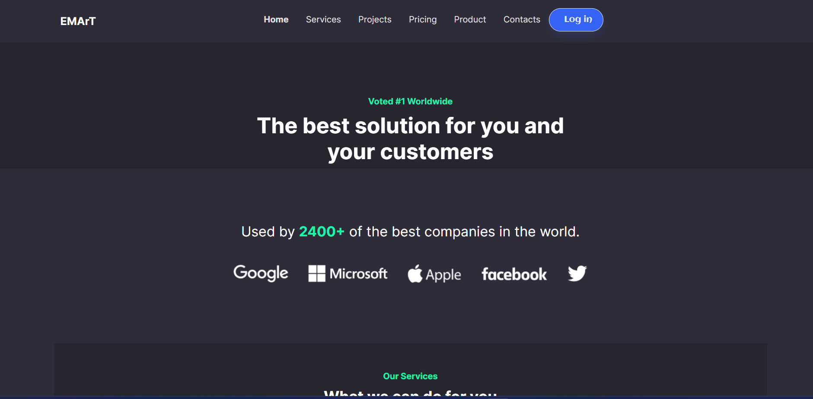
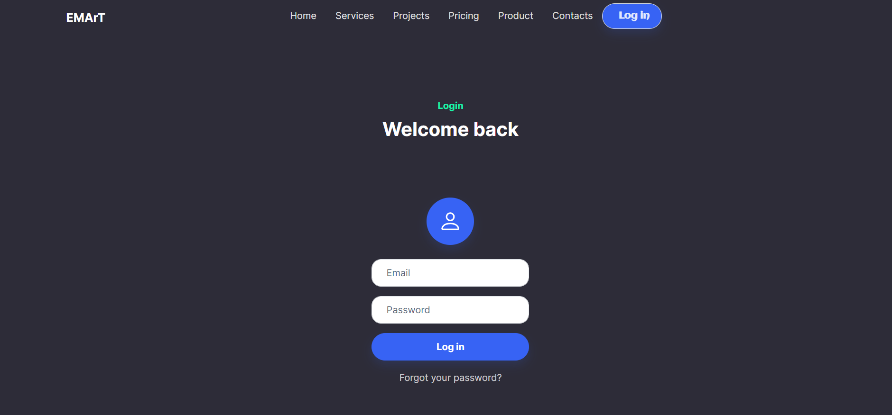
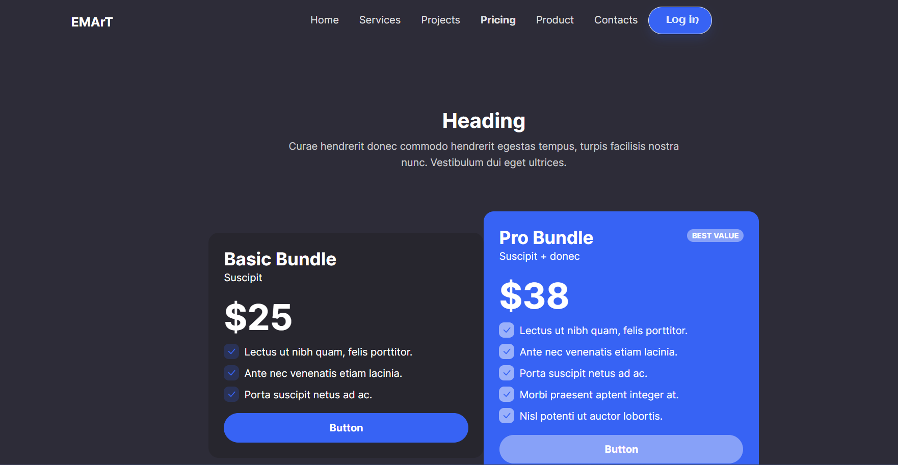

# Project Description -
# Project

Welcome to introduce our premium service bundle offer designed to cater to a variety of needs while providing exceptional value to our customers. This bundle comprises a selection of our most sought-after services, carefully curated to meet diverse requirements and budgets.

## Installation

1. Clone this repository: `git clone https://github.com/your-username/awesome-project.git`
2. Open `index.html` in your browser.

## Usage

Simply open `index.html` in your favorite web browser to view the project.

## Customization

Feel free to customize the HTML and CSS files to fit your needs. Add your own images, change colors, or modify the layout.

## Screenshots

Here are some screenshots of the project:

## Contributing

Contributions are welcome! Please fork this repository and submit a pull request with your changes.

## License

This project is licensed under the MIT License - see the [LICENSE](/LICENSE) file for details.
